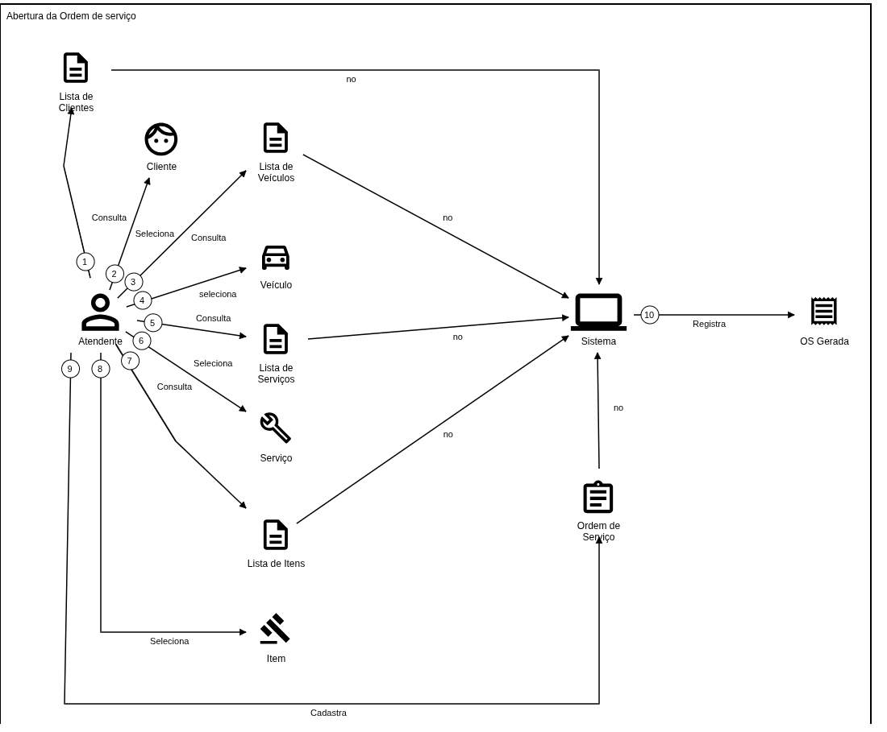
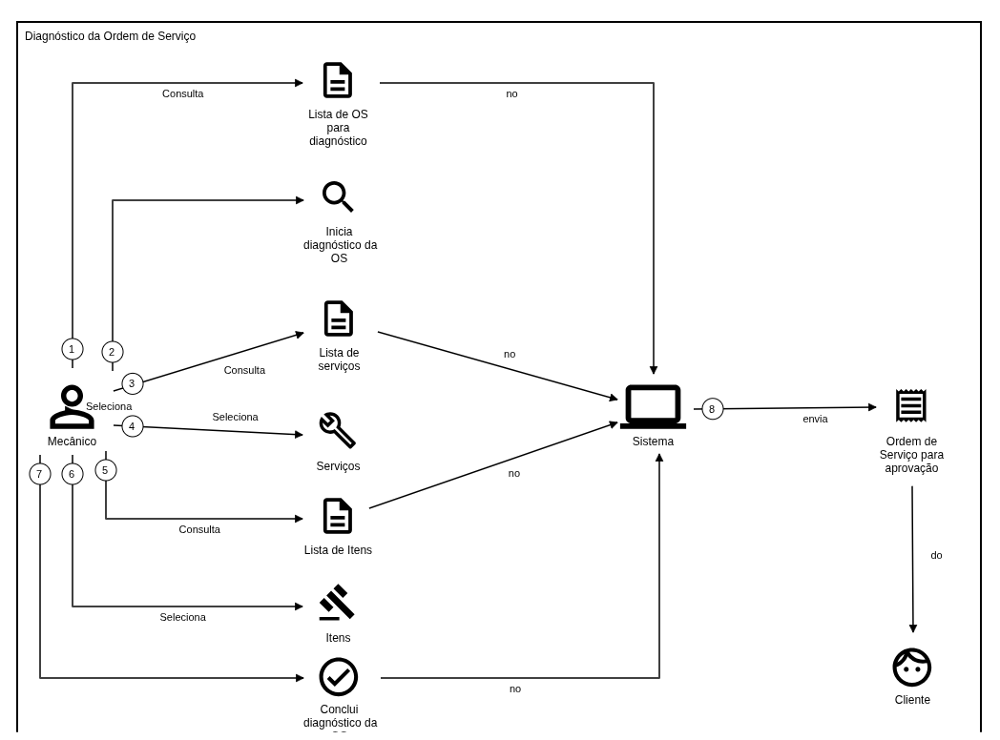
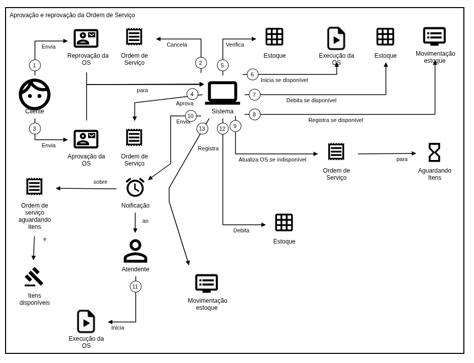
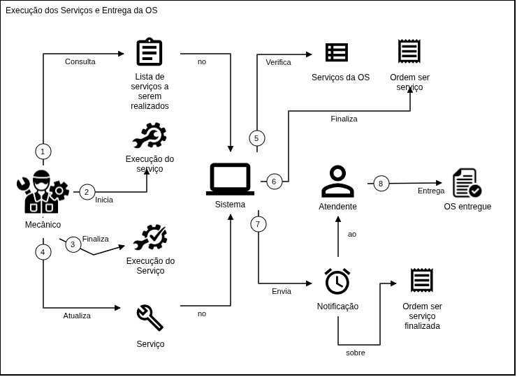

# Projeto Oficina API

Backend para gestao de oficina mecanica, desenvolvido com Spring Boot e PostgreSQL.
O projeto usa Docker Compose para subir o banco e a aplicacao em ambiente local.

## Tecnologias

- Java 17+
- Spring Boot
- Maven Wrapper
- Docker
- Docker Compose
- PostgreSQL
- Flyway
- Spring Security com JWT
- Springdoc OpenAPI

## Pre-requisitos

- Java 17 ou superior
- Docker e Docker Compose
- Maven opcional, pois o projeto inclui Maven Wrapper (`mvnw` e `mvnw.cmd`)
- PostgreSQL apenas se optar por rodar sem Docker

## Estrutura

```text
.
|-- src/
|   |-- main/
|   |   |-- java/br/com/prime/oficina/
|   |   |   |-- apipublica/
|   |   |   |-- auth/
|   |   |   |-- cliente/
|   |   |   |-- config/
|   |   |   |-- estoque/
|   |   |   |-- item/
|   |   |   |-- movimentoestoque/
|   |   |   |-- ordemservico/
|   |   |   |-- relatorio/
|   |   |   |-- security/
|   |   |   |-- servico/
|   |   |   |-- shared/
|   |   |   `-- veiculo/
|   |   `-- resources/
|   |       |-- db/migration/
|   |       |-- application.properties
|   |       |-- application-docker.properties
|   |       `-- application-test.properties
|   `-- test/
|-- Dockerfile
|-- docker-compose.yml
|-- .github/
|   `-- workflows/
|       `-- aws-deploy.yml
|-- infra/
|   `-- aws/
|       |-- main.tf
|       |-- outputs.tf
|       |-- providers.tf
|       |-- variables.tf
|       `-- versions.tf
|-- k8s/
|   `-- aws/
|       |-- 00-namespace.yaml
|       |-- 01-configmap.yaml.tpl
|       |-- 02-secret.yaml
|       |-- 03-app-deployment.yaml
|       |-- 04-app-service-loadbalancer.yaml
|       `-- 05-hpa.yaml
|-- mvnw
|-- mvnw.cmd
|-- pom.xml
|-- scripts/
|   `-- scripts-iniciais.txt
`-- README.md
```

Os módulos principais seguem uma organização inspirada em Clean Architecture e Ports and Adapters:

- `domain`: entidades e enums do domínio.
- `application`: regras de negócio, casos de uso, DTOs e portas.
- `application/usecase`: contratos de entrada usados pelos controllers.
- `application/gateway`: portas de saída para persistência ou integrações.
- `entrypoint/controller`: adapters de entrada HTTP/REST.
- `output/persistence`: adapters de saída que implementam os gateways usando Spring Data/JPA.

Essa estrutura aparece nos módulos `cliente`, `veiculo`, `servico`, `item`, `estoque`, `movimentoestoque`, `ordemservico` e `auth.gestaousuarios`. Pacotes como `shared`, `security`, `config`, `relatorio` e `apipublica` possuem organização propria por tratarem preocupações transversais ou fluxos mais específicos.

## Autenticacao e seguranca

As rotas administrativas usam autenticacao JWT.

Fluxo:

1. O usuario faz login em `POST /oficina/v1/auth/login`.
2. A API valida email e senha.
3. A API retorna um token JWT.
4. O token deve ser enviado nas proximas requisicoes:

```http
Authorization: Bearer <token>
```

Rotas publicas ficam em `/oficina/v1/public/**` e nao exigem token.

O usuario administrador inicial e criado pelo script de carga inicial do banco.
Execute `scripts/scripts-iniciais.txt` antes de usar a aplicacao em um banco novo.

### Login

```bash
curl -X POST http://localhost:8080/oficina/v1/auth/login \
  -H "Content-Type: application/json" \
  -d '{"email":"admin@oficina.com","senha":"admin"}'
```

Resposta esperada:

```json
{
  "token": "eyJhbGciOiJIUzI1NiJ9...",
  "tipo": "Bearer"
}
```

Use o token nas rotas administrativas:

```bash
curl http://localhost:8080/oficina/v1/clientes \
  -H "Authorization: Bearer <token>"
```

## Fluxo minimo de uso

Um fluxo basico para operar a oficina pela API:

1. Autenticar em `POST /auth/login`.
2. Cadastrar cliente em `POST /clientes`.
3. Cadastrar veiculo em `POST /veiculos`.
4. Cadastrar servicos em `POST /servicos`.
5. Cadastrar itens/pecas em `POST /itens`.
6. Ajustar estoque de itens em `PUT /estoques/item/{itemId}`.
7. Criar ordem de servico em `POST /ordens`, informando os servicos e, se necessario, os itens.
8. Iniciar diagnostico em `PATCH /ordens/{id}/iniciar-diagnostico`.
9. Adicionar itens complementares em `POST /ordens/{id}/itens`, se necessario.
10. Adicionar servicos complementares em `POST /ordens/{id}/servicos`, se necessario.
11. Solicitar aprovacao em `PATCH /ordens/{id}/solicitar-aprovacao`.
12. Aprovar ou reprovar em `PATCH /ordens/{id}/aprovar` ou `PATCH /ordens/{id}/reprovar`.
13. Iniciar e finalizar servicos em `PATCH /ordens/{id}/servicos/{servicoId}/iniciar` e `PATCH /ordens/{id}/servicos/{servicoId}/finalizar`.
14. Entregar a ordem em `PATCH /ordens/{id}/entregar`.
15. Consultar o andamento publico em `GET /public/ordens/codigo/{codigo}`.

Todos os caminhos acima consideram o prefixo `/oficina/v1`.

No cadastro da OS, serviços e itens podem ser enviados diretamente no corpo do `POST /ordens`. Para adicionar novos itens ou serviços depois da criacao, a OS precisa estar com status `EM_DIAGNOSTICO`; nesse caso, primeiro execute `PATCH /ordens/{id}/iniciar-diagnostico` e depois use `POST /ordens/{id}/itens` ou `POST /ordens/{id}/servicos`.

## Exemplos rapidos

### Criar cliente

```bash
curl -X POST http://localhost:8080/oficina/v1/clientes \
  -H "Authorization: Bearer <token>" \
  -H "Content-Type: application/json" \
  -d '{
    "nome": "Joao da Silva",
    "cpfCnpj": "12345678901",
    "telefone": "85999999999",
    "email": "joao@email.com",
    "cep": "60000000",
    "logradouro": "Rua A",
    "bairro": "Centro",
    "cidade": "Fortaleza",
    "uf": "CE",
    "data_nascimento": "1990-01-01"
  }'
```

### Criar ordem de servico

A ordem de serviço pode ser cadastrada já com serviços e itens vinculados. O campo `servicos` recebe uma lista de IDs de serviços, e o campo `itens` recebe os IDs dos itens com suas respectivas quantidades.

O campo `servicos` é obrigatório e deve conter pelo menos um serviço.

```bash
curl -X POST http://localhost:8080/oficina/v1/ordens \
  -H "Authorization: Bearer <token>" \
  -H "Content-Type: application/json" \
  -d '{
    "descricaoProblema": "Barulho no motor",
    "observacoesGerais": "Cliente relata ruido ao ligar",
    "descricaoServicosExecutados": "Diagnostico inicial",
    "clienteId": 1,
    "veiculoId": 1,
    "servicos": [1, 2],
    "itens": [
      {
        "itemId": 1,
        "quantidade": 2
      },
      {
        "itemId": 3,
        "quantidade": 1
      }
    ]
  }'
```

### Acompanhar ordem pela API publica

```bash
curl http://localhost:8080/oficina/v1/public/ordens/codigo/OS-2026-0001
```

### Aprovar ou reprovar ordem de servico

Depois do diagnostico, a OS deve ser enviada para aprovacao:

```bash
curl -X PATCH http://localhost:8080/oficina/v1/ordens/1/solicitar-aprovacao \
  -H "Authorization: Bearer <token>"
```

A solicitacao de aprovacao exige que a OS tenha pelo menos um item e um servico vinculados.

Para aprovar a OS:

```bash
curl -X PATCH http://localhost:8080/oficina/v1/ordens/1/aprovar \
  -H "Authorization: Bearer <token>"
```

A aprovacao so e permitida quando a OS esta com status `AGUARDANDO_APROVACAO`. Ao aprovar, a API tenta processar o estoque dos itens da OS. Se houver estoque suficiente, a OS segue para `EM_EXECUCAO`; se faltar estoque, ela segue para `AGUARDANDO_ITENS`.

Para reprovar a OS:

```bash
curl -X PATCH http://localhost:8080/oficina/v1/ordens/1/reprovar \
  -H "Authorization: Bearer <token>"
```

A reprovacao tambem so e permitida quando a OS esta com status `AGUARDANDO_APROVACAO`. Ao reprovar, os servicos vinculados sao cancelados e a OS passa para `CANCELADA`.

### Atualizar status da ordem de servico

As mudancas de status da OS sao feitas por endpoints `PATCH` especificos. A API valida a transicao permitida para cada acao e retorna erro de regra de negocio quando a OS esta em um status invalido para a operacao.

| Endpoint | Transicao / efeito | Regra principal |
| --- | --- | --- |
| `PATCH /ordens/{id}/iniciar-diagnostico` | `RECEBIDA` -> `EM_DIAGNOSTICO` | A OS deve estar `RECEBIDA`. |
| `PATCH /ordens/{id}/solicitar-aprovacao` | `EM_DIAGNOSTICO` -> `AGUARDANDO_APROVACAO` | A OS deve estar `EM_DIAGNOSTICO` e ter pelo menos um item e um servico. |
| `PATCH /ordens/{id}/aprovar` | `AGUARDANDO_APROVACAO` -> `APROVADA`; depois `EM_EXECUCAO` ou `AGUARDANDO_ITENS` | Se houver estoque suficiente, baixa estoque e inicia execucao; se faltar estoque, aguarda itens. |
| `PATCH /ordens/{id}/reprovar` | `AGUARDANDO_APROVACAO` -> `CANCELADA` | Cancela os servicos vinculados. |
| `PATCH /ordens/{id}/iniciar-execucao` | `AGUARDANDO_ITENS` -> `EM_EXECUCAO` | Usado apos reposicao/ajuste de estoque. |
| `PATCH /ordens/{id}/entregar` | `FINALIZADA` -> `ENTREGUE` | A OS deve estar `FINALIZADA`. |

Os servicos vinculados a OS tambem possuem transicoes proprias:

| Endpoint | Transicao / efeito | Regra principal |
| --- | --- | --- |
| `PATCH /ordens/{id}/servicos/{servicoId}/iniciar` | Servico da OS: `PENDENTE` -> `INICIADO` | A OS deve estar `EM_EXECUCAO`. |
| `PATCH /ordens/{id}/servicos/{servicoId}/finalizar` | Servico da OS: `INICIADO` -> `FINALIZADO` | A OS deve estar `EM_EXECUCAO`; ao finalizar todos os servicos, a OS passa para `FINALIZADA`. |

### Consultar status da ordem de servico

Para consultar apenas o status atual de uma OS pelo ID:

```bash
curl http://localhost:8080/oficina/v1/ordens/1/status \
  -H "Authorization: Bearer <token>"
```

Resposta esperada:

```json
{
  "codigo": "OS-2026-000001",
  "status": "EM_DIAGNOSTICO"
}
```

Esse endpoint retorna somente o codigo publico da OS e o status atual.

## Endpoints principais

| Recurso | Endpoints |
| --- | --- |
| Autenticacao | `POST /auth/login` |
| Usuarios | `POST /usuarios` |
| Clientes | `POST /clientes`, `GET /clientes`, `GET /clientes/{id}`, `PUT /clientes/{id}`, `DELETE /clientes/{id}` |
| Veiculos | `POST /veiculos`, `GET /veiculos`, `GET /veiculos/{id}`, `GET /veiculos/cliente/{clienteId}`, `PUT /veiculos/{id}`, `DELETE /veiculos/{id}` |
| Servicos | `POST /servicos`, `GET /servicos`, `GET /servicos/{id}`, `PUT /servicos/{id}`, `DELETE /servicos/{id}` |
| Itens | `POST /itens`, `GET /itens`, `GET /itens/{id}`, `GET /itens/tipo/{tipo}`, `PUT /itens/{id}`, `DELETE /itens/{id}` |
| Estoques | `GET /estoques`, `GET /estoques/item/{itemId}`, `PUT /estoques/item/{itemId}` |
| Movimentacoes de estoque | `GET /movimentacoes-estoque`, `GET /movimentacoes-estoque/item/{itemId}`, `GET /movimentacoes-estoque/item/{itemId}/tipo/{tipo}` |
| Ordens de servico | `POST /ordens`, `GET /ordens`, `GET /ordens/cliente/{id}`, `GET /ordens/codigo/{codigo}`, `GET /ordens/status/{status}`, `GET /ordens/{id}/status`, `PUT /ordens/{id}` |
| Fluxo da OS | `PATCH /ordens/{id}/iniciar-diagnostico`, `PATCH /ordens/{id}/solicitar-aprovacao`, `PATCH /ordens/{id}/aprovar`, `PATCH /ordens/{id}/reprovar`, `PATCH /ordens/{id}/iniciar-execucao`, `PATCH /ordens/{id}/entregar` |
| Servicos da OS | `PATCH /ordens/{id}/servicos/{servicoId}/iniciar`, `PATCH /ordens/{id}/servicos/{servicoId}/finalizar` |
| Relatorios | `GET /relatorios/ordens-servico/tempo-medio`, `GET /relatorios/ordens-servico/tempo-medio-servicos` |
| API publica | `GET /public/ordens/codigo/{codigo}` |

## Variaveis de ambiente

Crie um arquivo `.env` na raiz do projeto:

```bash
POSTGRES_DB=oficina
POSTGRES_USER=postgres
POSTGRES_PASSWORD=postgres

SPRING_DATASOURCE_URL=jdbc:postgresql://postgres:5432/oficina
SPRING_DATASOURCE_USERNAME=postgres
SPRING_DATASOURCE_PASSWORD=postgres

SECURITY_JWT_SECRET=jwt-docker-secret-123456789012345678901234567890
SECURITY_JWT_EXPIRATION=7200000
```

## Carga inicial do banco

Antes de usar a aplicacao em um banco novo, execute o arquivo:

```text
scripts/scripts-iniciais.txt
```

Esse script insere dados base para demonstracao e uso inicial da API:

- clientes;
- veiculos;
- servicos;
- itens;
- estoque inicial;
- movimentacoes iniciais de estoque;
- usuario administrador.

Credenciais do usuario administrador criado pelo script:

```text
Email: admin@oficina.com
Senha: admin
```

### Executando no banco Docker

Suba os containers para que o PostgreSQL esteja disponivel:

```bash
docker-compose up --build -d
```

Depois execute o script no container do PostgreSQL:

```bash
docker exec -i postgres_oficina psql -U postgres -d oficina < scripts/scripts-iniciais.txt
```

No Windows PowerShell, se o redirecionamento acima nao funcionar corretamente, use:

```powershell
Get-Content scripts\scripts-iniciais.txt | docker exec -i postgres_oficina psql -U postgres -d oficina
```

Execute essa carga apenas uma vez por banco novo. Rodar o script mais de uma vez pode gerar erros de duplicidade em registros que possuem restricoes unicas.

## Como rodar com Docker

Suba banco e aplicacao:

```bash
docker-compose up --build -d
```

Em um banco novo, execute a carga inicial:

```powershell
Get-Content scripts\scripts-iniciais.txt | docker exec -i postgres_oficina psql -U postgres -d oficina
```

Verifique os containers:

```bash
docker ps
```

Acompanhe os logs:

```bash
docker logs -f app_oficina
```

Para parar:

```bash
docker-compose down
```

## Como rodar localmente

Suba apenas o PostgreSQL:

```bash
docker-compose up -d postgres
```

Execute a aplicacao:

```bash
./mvnw spring-boot:run
```

No Windows:

```bash
.\mvnw.cmd spring-boot:run
```

## Perfis da aplicacao

- `default`: usa `application.properties`, indicado para execucao local da aplicacao apontando para PostgreSQL em `localhost`.
- `docker`: usa `application-docker.properties`, ativado pelo `docker-compose.yml` com `SPRING_PROFILES_ACTIVE=docker`.
- `test`: usa `application-test.properties`, ativado pelos testes de integracao.

## Documentacao OpenAPI

Swagger UI:

```text
http://localhost:8080/oficina/v1/swagger-ui/index.html#/
```

OpenAPI JSON:

```text
http://localhost:8080/oficina/v1/api-docs
```

A documentacao esta organizada por grupos:

- `autenticacao`
- `gestao-usuarios`
- `cliente`
- `veiculo`
- `servico`
- `item`
- `movimento-estoque`
- `estoque`
- `ordem-servico`
- `relatorio`
- `api-publica`

## Testes

Execute:

```bash
./mvnw test
```

No Windows:

```bash
.\mvnw.cmd test
```

Relatorio de cobertura JaCoCo:

```text
target/site/jacoco/index.html
```

Estado atual da suite: 143 testes passando.

## Relatorios de qualidade e seguranca

Os relatorios gerados para avaliacao do projeto estao disponiveis em `docs/relatorios`:

- [Relatorio JaCoCo](docs/relatorios/jacoco-relatorio.png): evidencia da cobertura de testes.
- [Relatorio Sonar](docs/relatorios/relatoriosonar.pdf): analise estatica de qualidade do codigo.
- [Relatorio OWASP ZAP](<docs/relatorios/ZAP Scanning Report.pdf>): analise dinamica de seguranca da API.

## Decisoes tecnicas

- Organizacao por modulos de dominio, como `cliente`, `veiculo`, `ordemservico`, `estoque`, `item`, `servico` e `auth`.
- Aplicacao de Clean Architecture e Ports and Adapters nos modulos principais.
- Controllers em `entrypoint/controller`, responsaveis pela entrada HTTP.
- Casos de uso, regras de negocio e DTOs em `application`.
- Contratos de entrada em `application/usecase`.
- Portas de saida em `application/gateway`.
- Adapters de persistencia em `output/persistence`, implementando os gateways.
- Entidades e enums em `domain`.
- Spring Data JPA encapsulado pelos adapters de persistencia.
- Flyway para versionamento do banco de dados.
- JWT para autenticacao das rotas administrativas.
- Springdoc OpenAPI para documentacao interativa.
- Testes unitarios e testes de controller com Spring.

## Documentacao DDD

- [Linguagem Ubiqua](docs/ddd/linguagem-ubiqua.md)
- Event Storming de pecas, servicos e ordem de servico: https://miro.com/app/board/uXjVGgeRsuQ=/?share_link_id=397857444241

### Storytelling de dominio

#### Registro da OS



#### Diagnostico da OS



#### Aprovacao e reprovacao da OS



#### Execucao e entrega da OS



## CI/CD

O workflow [`.github/workflows/aws-deploy.yml`](.github/workflows/aws-deploy.yml) executa somente manualmente por `workflow_dispatch`, para evitar gasto indevido no AWS Academy/Learner Lab.

Inputs:

- `deploy`: roda testes Maven, empacota a aplicacao, publica imagem no Docker Hub, cria/atualiza AWS com Terraform, aplica manifests no EKS e executa smoke test no OpenAPI.
- `destroy`: remove recursos Kubernetes primeiro, aguarda a remocao do Load Balancer e depois executa `terraform destroy`.

Os secrets e o modo de execucao manual estao detalhados na secao `Deploy pelo GitHub Actions`.

## Deploy AWS com EKS + RDS

Esta secao assume que o AWS Academy/Learner Lab ja esta iniciado e que o AWS CLI ja esta configurado com o profile `academy`.

Arquitetura:

```text
Usuario
  -> AWS Load Balancer publico
      -> Kubernetes Service oficina-api
          -> Pod oficina-api no EKS
              -> RDS PostgreSQL privado
```

Pastas usadas:

- Terraform AWS: `infra/aws/`
- Manifests Kubernetes AWS: `k8s/aws/`
- Arquivos gerados localmente: `k8s/aws/generated/` (nao versionado)
- Imagem Docker Hub: `anthonymeds/oficina-api:aws-v1`

O deploy usa Docker Hub porque o AWS Academy/Learner Lab bloqueou permissoes de push no ECR.

### Passo a passo do deploy

Execute os comandos abaixo a partir da raiz do projeto.

1. Validar a sessao AWS do Lab:

```bash
aws sts get-caller-identity --profile academy
aws ec2 describe-vpcs --region us-east-1 --profile academy
aws eks list-clusters --region us-east-1 --profile academy
aws rds describe-db-instances --region us-east-1 --profile academy
```

Se algum comando falhar por credencial expirada, copie novamente as credenciais temporarias do Learner Lab para o profile `academy`.

2. Rodar testes e empacotar a aplicacao:

```bash
./mvnw test
./mvnw package -DskipTests
```

No Windows PowerShell:

```powershell
.\mvnw.cmd test
.\mvnw.cmd package -DskipTests
```

3. Publicar a imagem no Docker Hub:

```bash
docker login
docker build -t anthonymeds/oficina-api:aws-v1 .
docker push anthonymeds/oficina-api:aws-v1
```

4. Definir a senha do RDS para o Terraform:

```bash
export TF_VAR_db_password='Oficina12345!'
```

No Windows PowerShell:

```powershell
$env:TF_VAR_db_password='Oficina12345!'
```

5. Criar a infraestrutura AWS:

```bash
terraform -chdir=infra/aws init
terraform -chdir=infra/aws fmt
terraform -chdir=infra/aws validate
terraform -chdir=infra/aws plan
terraform -chdir=infra/aws apply
```

O Terraform cria:

- tags nas subnets;
- Security Group;
- DB Subnet Group;
- RDS;
- EKS;
- Managed Node Group.

A AZ `us-east-1e` fica fora das subnets do EKS porque o control plane retornou `UnsupportedAvailabilityZoneException` nesse Learner Lab.

6. Configurar o `kubectl` para o EKS:

```bash
aws eks update-kubeconfig --region us-east-1 --name oficina-eks --profile academy
kubectl get nodes
```

7. Instalar o metrics-server:

```bash
kubectl apply -f https://github.com/kubernetes-sigs/metrics-server/releases/latest/download/components.yaml
kubectl get deployment metrics-server -n kube-system
kubectl top nodes
```

8. Gerar o ConfigMap com o endpoint do RDS:

```bash
RDS_ENDPOINT=$(aws rds describe-db-instances \
  --db-instance-identifier oficina-db \
  --region us-east-1 \
  --profile academy \
  --query 'DBInstances[0].Endpoint.Address' \
  --output text)

mkdir -p k8s/aws/generated

sed "s|__RDS_ENDPOINT__|$RDS_ENDPOINT|g" \
  k8s/aws/01-configmap.yaml.tpl \
  > k8s/aws/generated/01-configmap.yaml
```

No Windows PowerShell:

```powershell
$RDS_ENDPOINT = aws rds describe-db-instances `
  --db-instance-identifier oficina-db `
  --region us-east-1 `
  --profile academy `
  --query 'DBInstances[0].Endpoint.Address' `
  --output text

New-Item -ItemType Directory -Force k8s/aws/generated | Out-Null

(Get-Content k8s/aws/01-configmap.yaml.tpl) `
  -replace '__RDS_ENDPOINT__', $RDS_ENDPOINT `
  | Set-Content k8s/aws/generated/01-configmap.yaml
```

9. Aplicar os manifests no EKS:

```bash
kubectl apply -f k8s/aws/00-namespace.yaml
kubectl apply -f k8s/aws/generated/01-configmap.yaml
kubectl apply -f k8s/aws/02-secret.yaml
kubectl apply -f k8s/aws/03-app-deployment.yaml
kubectl apply -f k8s/aws/04-app-service-loadbalancer.yaml
kubectl apply -f k8s/aws/05-hpa.yaml
```

O arquivo `k8s/aws/02-secret.yaml` existe para simplicidade academica do Lab. No CI/CD, a Secret Kubernetes e gerada a partir de GitHub Secrets.

10. Aguardar o rollout da API:

```bash
kubectl rollout status deployment/oficina-api -n oficina --timeout=300s
kubectl get pods -n oficina
kubectl get svc oficina-api -n oficina
kubectl get hpa -n oficina
```

11. Obter o DNS publico do Load Balancer:

```bash
LB_DNS=$(kubectl get svc oficina-api -n oficina -o jsonpath='{.status.loadBalancer.ingress[0].hostname}')
echo $LB_DNS
```

No Windows PowerShell:

```powershell
$LB_DNS = kubectl get svc oficina-api -n oficina -o jsonpath='{.status.loadBalancer.ingress[0].hostname}'
$LB_DNS
```

12. Testar OpenAPI e Swagger:

```bash
curl "http://$LB_DNS/oficina/v1/api-docs"
```

Swagger:

```text
http://<load-balancer-dns>/oficina/v1/swagger-ui.html
```

OpenAPI:

```text
http://<load-balancer-dns>/oficina/v1/api-docs
```

### Consultar RDS sem expor publicamente

O RDS fica privado. Nao altere `publicly_accessible=false` para consultas.

Opcao 1: pod temporario com `psql`:

```bash
DB_HOST=$(aws rds describe-db-instances \
  --db-instance-identifier oficina-db \
  --region us-east-1 \
  --profile academy \
  --query 'DBInstances[0].Endpoint.Address' \
  --output text)

kubectl run psql-client \
  -n oficina \
  --rm -it \
  --image=postgres:16 \
  --restart=Never \
  --env="PGPASSWORD=Oficina12345!" \
  -- psql -h "$DB_HOST" -U oficina_user -d oficina
```

Opcao 2: DBeaver/IntelliJ via tunel Kubernetes:

```bash
DB_HOST=$(aws rds describe-db-instances \
  --db-instance-identifier oficina-db \
  --region us-east-1 \
  --profile academy \
  --query 'DBInstances[0].Endpoint.Address' \
  --output text)

kubectl run rds-tunnel \
  -n oficina \
  --image=alpine/socat \
  --restart=Never \
  -- TCP-LISTEN:5432,fork,reuseaddr TCP:$DB_HOST:5432

kubectl port-forward pod/rds-tunnel 5432:5432 -n oficina
```

Conexao DBeaver/IntelliJ:

```text
Host: localhost
Port: 5432
Database: oficina
User: oficina_user
Password: Oficina12345!
```

Ao finalizar:

```bash
kubectl delete pod rds-tunnel -n oficina --ignore-not-found
```

### Deploy pelo GitHub Actions

O workflow AWS e manual para evitar gasto acidental no Lab.

1. Atualize os secrets do repositorio com as credenciais temporarias da sessao atual do Learner Lab.
2. Acesse `Actions`.
3. Selecione `AWS Deploy EKS RDS`.
4. Clique em `Run workflow`.
5. Escolha `deploy`.
6. Acompanhe o log ate a impressao das URLs de OpenAPI e Swagger.

Secrets usados:

```text
AWS_ACCESS_KEY_ID
AWS_SECRET_ACCESS_KEY
AWS_SESSION_TOKEN
AWS_REGION=us-east-1
DOCKERHUB_USERNAME=anthonymeds
DOCKERHUB_TOKEN
DB_PASSWORD=Oficina12345!
SECURITY_JWT_SECRET
```

### Como destruir o ambiente AWS no final do Lab

EKS, EC2 node group, RDS, Load Balancer, EBS e snapshots podem consumir credito. Execute o destroy ao final dos testes.

```bash
# Remover recursos Kubernetes que criam Load Balancer
kubectl delete -f k8s/aws/05-hpa.yaml --ignore-not-found
kubectl delete -f k8s/aws/04-app-service-loadbalancer.yaml --ignore-not-found
kubectl delete -f k8s/aws/03-app-deployment.yaml --ignore-not-found
kubectl delete -f k8s/aws/02-secret.yaml --ignore-not-found
kubectl delete -f k8s/aws/generated/01-configmap.yaml --ignore-not-found
kubectl delete -f k8s/aws/00-namespace.yaml --ignore-not-found

# Aguardar remocao do Load Balancer
aws elbv2 describe-load-balancers --region us-east-1 --profile academy
aws elb describe-load-balancers --region us-east-1 --profile academy

# Destruir infraestrutura Terraform
terraform -chdir=infra/aws destroy

# Conferencias finais
aws eks list-clusters --region us-east-1 --profile academy
aws rds describe-db-instances --region us-east-1 --profile academy
aws ec2 describe-instances \
  --region us-east-1 \
  --profile academy \
  --filters Name=instance-state-name,Values=running,pending \
  --query 'Reservations[*].Instances[*].[InstanceId,InstanceType,State.Name,Tags]' \
  --output table

aws elbv2 describe-load-balancers --region us-east-1 --profile academy
aws elb describe-load-balancers --region us-east-1 --profile academy
```

Pelo GitHub Actions, execute o mesmo workflow `AWS Deploy EKS RDS` com a opcao `destroy`.

## Solucao de problemas

### Porta 5432 ja esta em uso

Outro PostgreSQL pode estar rodando localmente. Pare o servico local ou altere o mapeamento de porta do servico `postgres` no `docker-compose.yml`.

### Porta 8080 ja esta em uso

Altere `server.port` no `application.properties` ou pare o processo que esta usando a porta.

### Variaveis do `.env` nao foram carregadas

Confirme se o arquivo `.env` esta na raiz do projeto e se os nomes das variaveis batem com o `docker-compose.yml`.

### Erro de autenticacao em banco novo

Execute `scripts/scripts-iniciais.txt` para inserir o usuario administrador inicial.

### Testes falham por conexao com banco

Os testes de integracao usam PostgreSQL conforme `application-test.properties`. Verifique se o banco local esta rodando e acessivel em `localhost:5432`.
