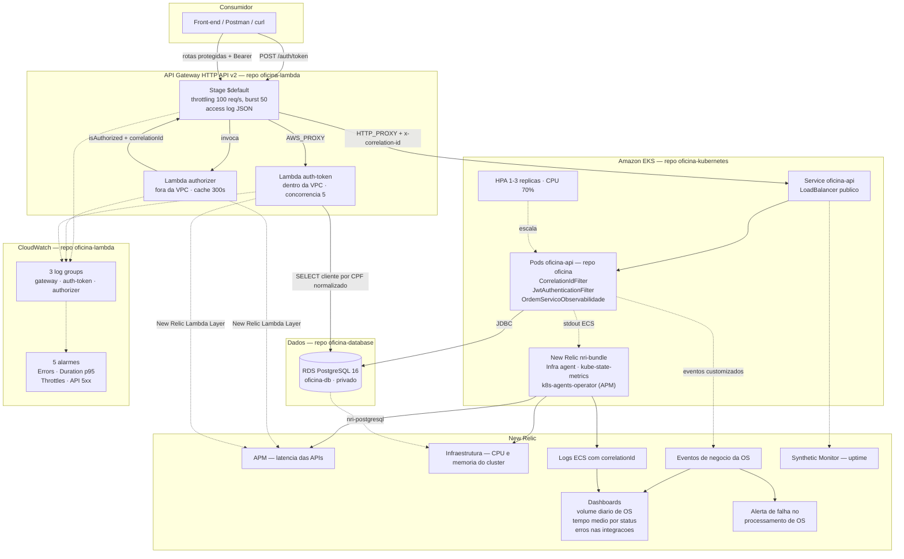

# Diagrama de Componentes

Visão de nuvem da arquitetura da Fase 3: APIs, banco, serverless e monitoramento, com a origem de
cada peça nos quatro repositórios.

## De onde vem cada componente

| Componente | Repositório | Provisionado por |
| --- | --- | --- |
| API Spring Boot, imagem Docker | `oficina` | Pipeline `app-deploy.yml` (build, push, `kubectl set image`) |
| Cluster EKS, manifests, HPA, New Relic no cluster | `oficina-kubernetes` | Terraform + `kubectl apply` + `helm` |
| RDS PostgreSQL | `oficina-database` | Terraform |
| API Gateway, `auth-token`, `authorizer`, alarmes | `oficina-lambda` | Terraform com state em S3, aplicado pela pipeline |

## Os dois caminhos de entrada

**Emissão de token** — `POST /auth/token` é rota aberta, integrada por `AWS_PROXY` à function
`auth-token`, que consulta o RDS diretamente e devolve o JWT. Não passa pelo cluster.

**Requisição protegida** — cai na rota `$default`, que invoca o `authorizer` antes de encaminhar. Só
com `isAuthorized: true` a requisição chega ao LoadBalancer. A aplicação então **revalida o mesmo
token** por conta própria, porque o LoadBalancer é público e o Gateway sozinho não é fronteira de
rede (ver [ADR-0001 do `oficina-lambda`](https://github.com/rremiao/oficina-lambda/blob/main/docs/adr/0001-dupla-validacao-jwt.md)).

Seis rotas ficam abertas por decisão explícita: o login de operador, `/public/{proxy+}`, o Swagger
UI e o OpenAPI. O cadastro de usuários permanece protegido.

## Observabilidade: dois destinos, propósitos diferentes

**New Relic** é a ferramenta de observabilidade do sistema (requisito do desafio): APM com latência
das APIs, consumo de CPU e memória do cluster, uptime por Synthetic Monitor, logs ECS, eventos
customizados de negócio da OS e os três dashboards pedidos. As duas Lambdas também reportam ali, via
New Relic Lambda Layer.

**CloudWatch** continua sendo o destino nativo dos logs das Lambdas e do access log do Gateway, com
cinco alarmes de infraestrutura. Os dois coexistem: o CloudWatch é o log cru e o alarme de borda; o
New Relic é a visão unificada e de negócio.

O elo entre tudo é o `correlationId`, que atravessa access log do Gateway → log do authorizer → log
da aplicação. Detalhe em [ADR-0005](adr/0005-observabilidade-da-aplicacao.md).

## Escalabilidade

| Camada | Mecanismo | Limite |
| --- | --- | --- |
| Aplicação | HPA por CPU (70%) | 1 a 3 réplicas |
| `authorizer` | Concorrência Lambda padrão | Sem limite |
| `auth-token` | Concorrência reservada | 5 execuções simultâneas, para não esgotar as conexões do `db.t3.micro` |
| Banco | Instância fixa | `db.t3.micro` |

Fluxos detalhados em [autenticação](diagrama-sequencia-autenticacao.md) e
[abertura de OS](diagrama-sequencia-abertura-os.md).
