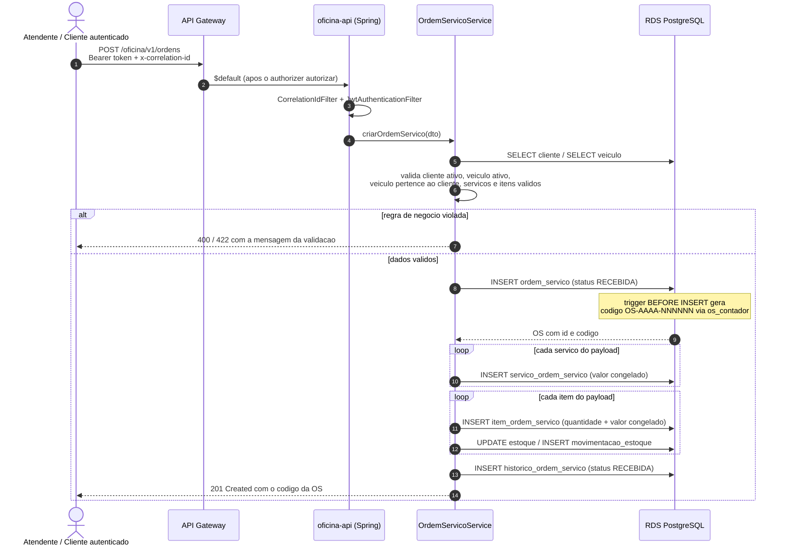

# Diagrama de Sequência — Abertura de Ordem de Serviço

Fluxo interno da aplicação: não atravessa Lambda nenhuma, mas passa pelo
API Gateway como qualquer rota protegida (ver
[diagrama de sequência da autenticação](diagrama-sequencia-autenticacao.md)).

## Pontos que o diagrama revela

- **O código da OS não é gerado pela aplicação.** Um trigger `BEFORE
  INSERT` calcula `OS-2026-000001` a partir da tabela `os_contador`, com
  reset anual automático — detalhe na seção 4.2 de
  [der.md do oficina-database](https://github.com/rremiao/oficina-database/blob/main/docs/der.md).
- **Valores são congelados na associativa.** `servico_ordem_servico` e
  `item_ordem_servico` guardam o `valor_unitario` do momento, não uma
  referência ao preço atual do catálogo.
- **Cada serviço da OS tem ciclo de vida próprio** (`status`,
  `data_inicio`, `data_fim` em `servico_ordem_servico`), separado do status
  da OS como um todo.
- **`historico_ordem_servico` registra cada transição**, e é a fonte do
  dashboard de tempo médio de execução por status no New Relic.
- A baixa de estoque grava em `movimentacao_estoque` com o
  `ordem_servico_id` — a coluna **sem FK** descrita na seção 4.4 do
  documento de modelo de dados.

## Autorização

Tanto um token de operador (`ROLE_ADMIN`) quanto um token de cliente
(`ROLE_CLIENTE`, emitido pela Lambda) alcançam as rotas protegidas hoje —
a separação por perfil por rota está registrada como pendência em
[RFC-0002](rfc/0002-estrategia-de-autenticacao.md).

> Existe também uma versão deste fluxo em SVG/PNG, produzida na branch
> `docs/OS` do repositório (`docs/fluxo-abertura-os.svg`). As duas
> descrevem o mesmo fluxo — convém manter só uma como referência oficial.
