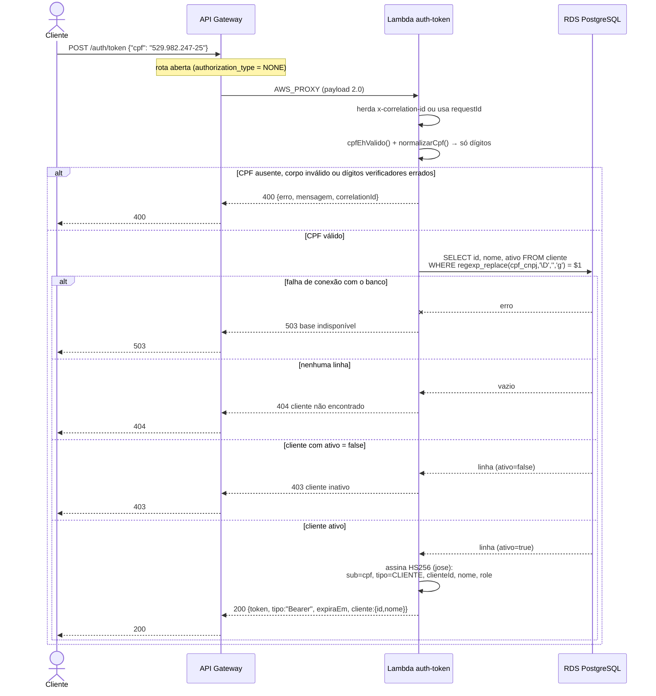
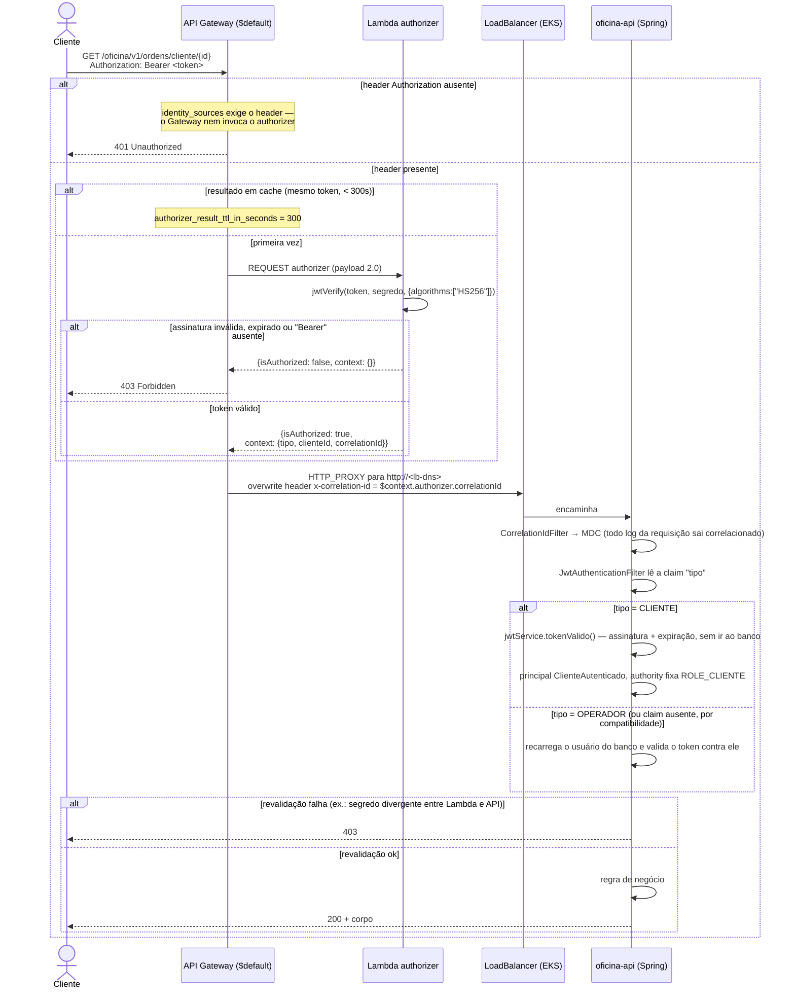

# Diagrama de Sequência — Autenticação (Fase 3)

Dois fluxos: a emissão do token de cliente pela Lambda `auth-token` e a
validação de uma requisição protegida (Lambda `authorizer` na borda +
revalidação independente na aplicação).

## 1. Emissão do token de cliente

O log da `auth-token` registra `cpf` como **digital SHA-256 truncada em 12
caracteres**, nunca em claro — permite correlacionar tentativas do mesmo
documento sem gravar dado pessoal.

## 2. Requisição protegida (`$default`)

### Por que 401 num caso e 403 no outro

Não é escolha da aplicação: o `identity_sources = ["$request.header.Authorization"]`
faz o **API Gateway** responder `401` sozinho quando o header não existe,
sem sequer invocar o authorizer. Quando o header existe mas o token é
inválido, quem responde é o authorizer com `isAuthorized: false`, e o
Gateway traduz isso em `403`.

### O que o `context` do authorizer significa (e o que não significa)

O authorizer devolve `tipo`, `clienteId` e `correlationId` no `context`. Só
o `correlationId` é efetivamente consumido (o Gateway o injeta no header
para o backend). `tipo` e `clienteId` servem para log — **não são fonte de
autorização**, porque a aplicação revalida o token por conta própria de
qualquer forma. Isso é deliberado, ver
[ADR-0001 do oficina-lambda](https://github.com/rremiao/oficina-lambda/blob/main/docs/adr/0001-dupla-validacao-jwt.md).

## Rotas que não passam pelo authorizer

Definidas em `local.rotas_abertas` (`oficina-lambda/infra/main.tf`):

| Rota | Por quê |
| --- | --- |
| `POST /auth/token` | É onde o token nasce; não há token para validar antes dela |
| `POST /oficina/v1/auth/login` | Troca de credencial por token do operador — mesmo motivo |
| `ANY /oficina/v1/public/{proxy+}` | Rotas públicas por definição |
| `GET /oficina/v1/swagger-ui.html` e `/swagger-ui/{proxy+}` | Documentação navegável |
| `GET /oficina/v1/api-docs` e `/api-docs/{proxy+}` | Contrato OpenAPI (também usado pelas probes) |

O cadastro de usuários (`/oficina/v1/usuarios`) **continua sob o
authorizer** — foi decisão explícita não abri-lo.

## Login de funcionário

Segue exatamente como na Fase 2: `POST /oficina/v1/auth/login` com e-mail e
senha, a aplicação valida o hash BCrypt e emite um token com
`tipo = OPERADOR`. A única diferença é que agora a requisição chega pelo
Gateway em vez de direto no LoadBalancer.

Ver também [RFC-0002 — estratégia de autenticação](rfc/0002-estrategia-de-autenticacao.md) e
[ADR-0004 — dois tipos de token](adr/0004-dois-tipos-de-token-jwt.md).
